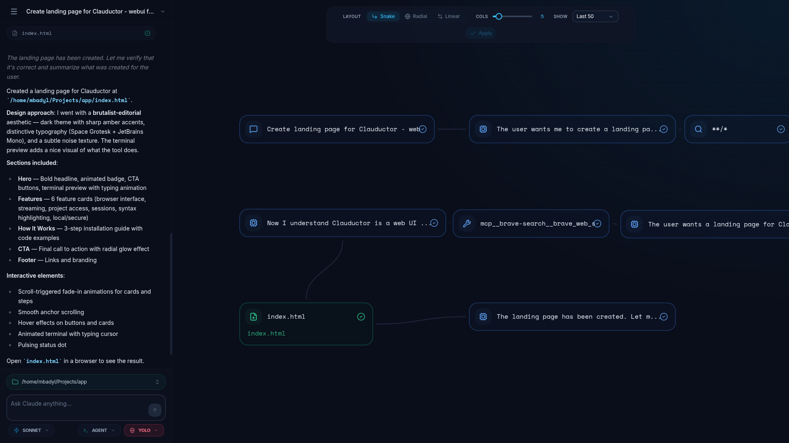

# Clauductor

Visual web interface for Claude Code. See your AI's work as a real-time execution map - tool calls, file edits, bash commands while chatting.



## Features

- Real-time work map - see every tool call, file edit, and bash command visualized as it happens
- Live chat with Claude Code in the browser
- Bash output streaming - watch command output appear as it runs
- Built-in MCP server for tool approval prompts
- Session management - history, restore, and multiple concurrent sessions
- Self-hosted - run on your server and use Claude Code from any device, anywhere
- Single binary - no dependencies, works on Linux, macOS, Windows

## Installation

Linux / macOS:

```bash
curl -fsSL https://raw.githubusercontent.com/mikolajbadyl/clauductor/main/install.sh | sh
```

On Linux, the installer picks `.deb` or `.rpm` if available, otherwise drops a standalone binary.

Windows (PowerShell):

```powershell
iex (iwr -useb https://raw.githubusercontent.com/mikolajbadyl/clauductor/main/install.ps1)
```

You can also grab binaries from [Releases](https://github.com/mikolajbadyl/clauductor/releases) or build from source with `make build`.

## Usage

```bash
# Default - localhost:8080
clauductor

# Custom host and port
clauductor --host 0.0.0.0 --port 3003
```

Open `http://localhost:8080` in your browser.

## MCP server

Clauductor ships with a built-in MCP server for tool approval. The installer can set this up for you, or add it with the Claude CLI:

```bash
claude mcp add --scope user clauductor-mcp -- $(which clauductor) --mcp
```

Or add it manually to `~/.claude.json`:

```json
{
  "mcpServers": {
    "clauductor-mcp": {
      "type": "stdio",
      "command": "/path/to/clauductor",
      "args": ["--mcp"]
    }
  }
}
```

The MCP server auto-detects the backend port. Override with `BACKEND_URL` env var if needed.

## Build

```bash
# Single binary (current platform)
make build

# Cross-compile for all platforms
make cross

# Release with GoReleaser (creates .tar.gz, .deb, .rpm)
goreleaser release --clean
```

## License

MIT
